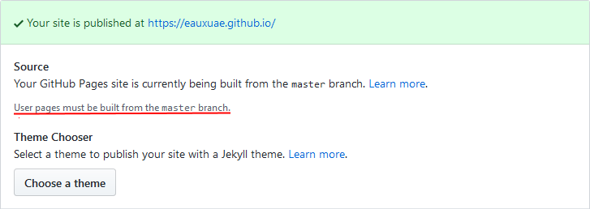

Avant de commencer à écrire sur Perl, voici quelques notes sur la mise en place de ce site propulsé par Poole sur GitHub Pages.

[Poole](http://getpoole.com/) est un projet qui a pour mission de fournir une configuration de base claire et concise avec des exemples de modèles, de pages, de publications et de styles pour tout site Jekyll. [Jekyll](https://jekyllrb.com/) est un générateur de site simple et extensible, écrit en [Ruby](https://www.ruby-lang.org/) et utilisant [Liquid](https://shopify.github.io/liquid/). Il fonctionne en convertissant des fichiers [Markdown](https://daringfireball.net/projects/markdown/) en [HTML](https://w3c.github.io/html/) pour générer des sites statiques ou des blogs. [GitHub Pages](https://pages.github.com/) étant alimenté par Jekyll, c'est le choix le plus évident pour héberger du contenu sur ce service.

Avant de pouvoir utiliser Poole, il faut installer le paquet [ruby-dev](https://packages.ubuntu.com/bionic/ruby-dev) avec la commande `sudo apt-get install ruby-dev` ainsi que Jekyll avec `sudo gem install jekyll`. Avec un i3-6100U et 8 Go. de RAM, ces deux installations prennent à peu près deux heures, donc pas d'inquiétudes et un peu de patience. ☕

Une fois ces paquets installés, la mise en place de Poole est assez simple, il suffit de bifurquer son [dépôt](https://github.com/poole/poole) et de cloner celui-ci sur votre ordinateur.

Attention, contrairement à ce qui est indiqué dans les instructions d'utilisation de Poole, si les ressources de votre site se trouvent dans un dépôt de type `username.github.io`, *il ne faut pas modifier la branche `gh-pages` et il faut rester sur la branche `master`*, parce que GitHub permet uniquement de construire ces pages utilisateurs à partir de la branche `master` : 

En suivant ces mêmes instructions d'utilisation, vous pouvez configurer votre installation en modifiant le fichier `_config.yml`. Si la pagination est activée, il faut penser à rajouter `plugins:    [jekyll-paginate]` dans ce même fichier, sans quoi les articles n'apparaitront pas lors du développement local.

Ci-dessous la liste des modifications supplémentaires que j'ai apporté de mon côté :

1. Ayant décidé d'écrire en français, j'ai traduit les éléments de pagination (https://github.com/eauxuae/eauxuae.github.io/commit/da99c228bfe0fa0ca5a95771da5774257cddc2d6), les dates des articles (https://github.com/eauxuae/eauxuae.github.io/commit/ec8245336cb2aca4c179c8875dd7d941d0ab46ea) grâce à ces [exemples](http://alanwsmith.com/jekyll-liquid-date-formatting-examples) et la page d'erreur 404 (https://github.com/eauxuae/eauxuae.github.io/commit/bab7df06e145e1f130e31f9ed84064723afaf159).
2. J'ai désactivé la propriété `border-radius` (https://github.com/eauxuae/eauxuae.github.io/commit/26bc1b63f2f77c634ee790590d7ac2d4dcf37901).
3. J'ai mis à jour le pied de page avec une licence Creative Commons (https://github.com/eauxuae/eauxuae.github.io/commit/920ff8971176b6b44e33aad596df880932990405).
4. J'ai modifié les icônes (https://github.com/eauxuae/eauxuae.github.io/commit/143c8e8e3357f52f4d9a5f8271dad592778462c1) en utilisant cette [ressource](https://www.flaticon.com/free-icon/drop_616878). 
5. J'ai remplacé le fichier `.gitignore` par celui de Jekyll (https://github.com/eauxuae/eauxuae.github.io/commit/4ec0c6f95d461f7acf88870d43539170f9e6dd4c).

Il y a quelques exemples d'articles dans le dossier `_posts` et cette [antisèche Markdown](https://guides.github.com/pdfs/markdown-cheatsheet-online.pdf) est assez pratique pour la rédaction en cas de besoin.

Après avoir fait tout ça, placez-vous dans le dossier de votre projet Poole, exécutez la commande `jekyll serve` et allez sur http://localhost:4000 afin de visiter votre site sur votre ordinateur.

Dès que vous pousserez votre travail sur le dépôt distant, GitHub se fera un plaisir de générer et de publier votre site en ligne.
